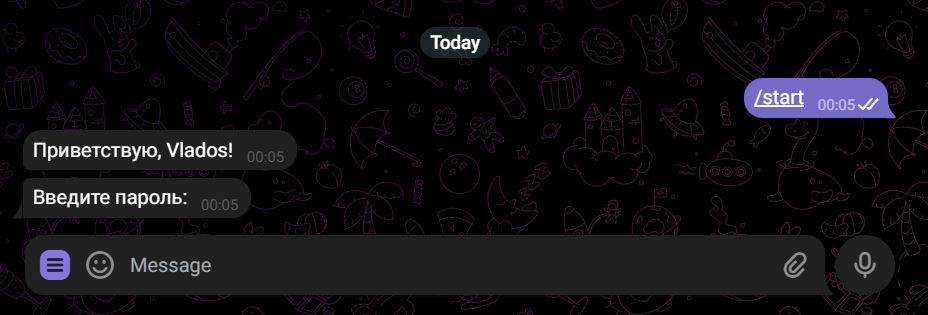
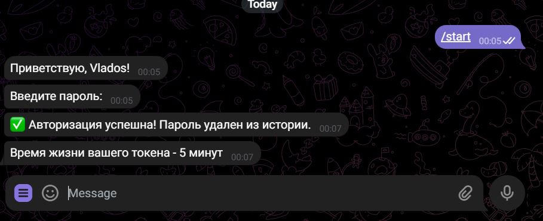
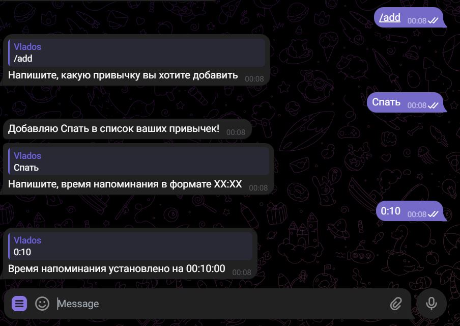
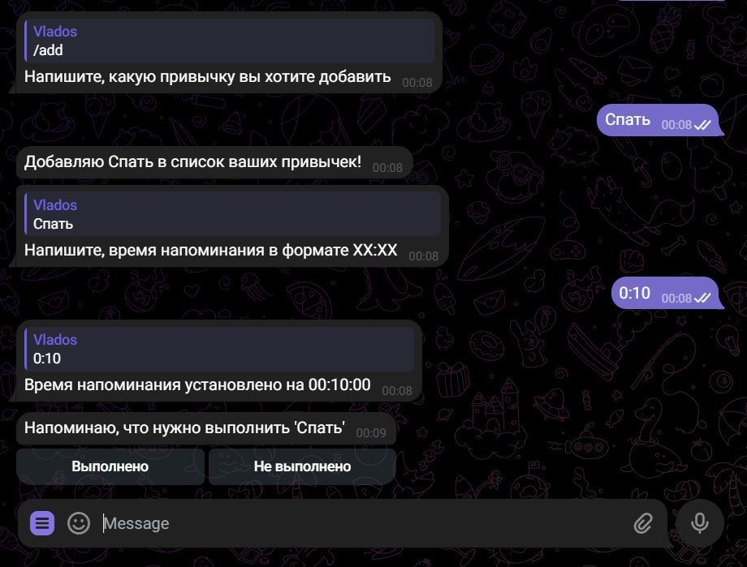
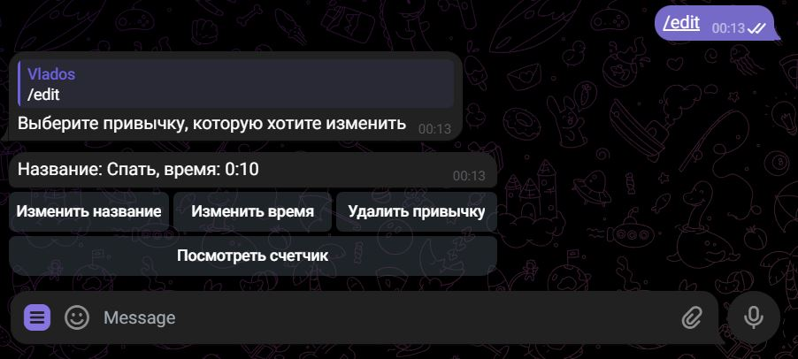
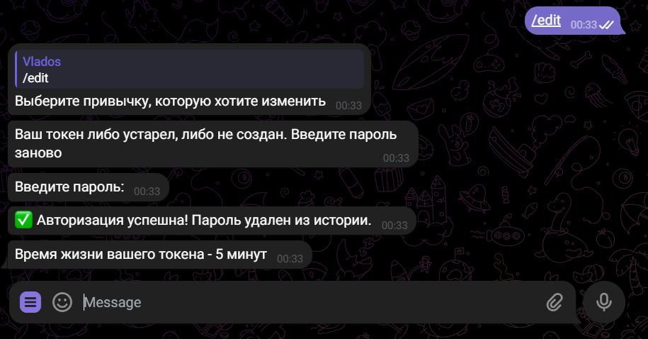
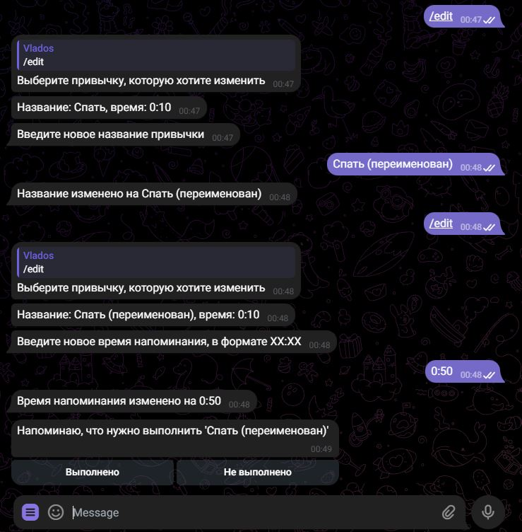
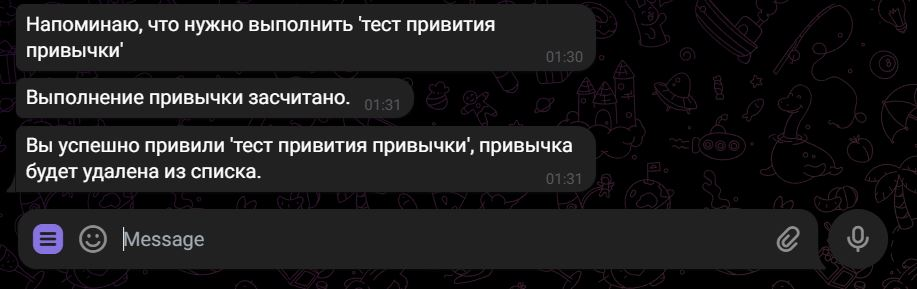

# Telegram bot tracking habits 

Данный проект позволяет пользователю привить привычки с помощью бота в Telegram.
Помогает пользователю лучше контролировать выполнение заданных им привычек.
 
## Технологический стек
- Python 3.11
- Poetry
- PostgreSQL
- SQLAlchemy
- Alembic
- PytelegramBotAPI
- FastAPI 
- PyJWT 
- Apscheduler
- Docker-compose

## Установка
1. Клонируйте репозиторий:
   ```bash
   git clone https://github.com/VladGrab/tg_habit_bot.git
   ```
2. Установка Docker:
   ```bash
   pip install docker==7.1.0
   ```
3. Создаем и запускаем связку контейнеров:
   ```bash
   docker-compose up --build
   ```
   
## 📝 Пример использования

- Начало работы бота

- После введения пароля. Время жизни токена изменено на 20 минут

- Добавление привычки

- Получение напоминания

- Выбор действия 'Выполнено'

- Просмотр списка привычек

- Истекло время действия токена

- Изменение названия и времени напоминания

- Привитие привычки
